# Introduction

**DevExpress.MailClient.Win** is a .NET Framework 4.7.2 Windows Forms application, utilizing:
- evaluation version of DevExpress WinForms components for superior user experience, resembling familiar UI of Microsoft Outlook, and allowing very flexible capabilities for UI theme selection at runtime.
- MS SQL Server/SQL Express database as the backend

# Functionality Description

1. Application allows adding/editing/removing ToDo tasks, similarly like Microsoft Outlook allows task management:
   1. tasks can be scheduled for a particular day and time, they end at a particular time, day, or take entire day or multiple days
   2. tasks can be one-time or recurrent - in the latter case, a task can have its recurrence pattern defined using the familiar Microsoft Outlook UI
   3. tasks can have categories, which provide a specific background task color on the schedule view
   4. tasks can have a location
   5. tasks can have a task disposition specifying whether the user is available, out of office etc.
   5. tasks can have a description
   6. tasks can have a **reminder** defined, which ensures that before the task is due to start the user is reminded of it by seeing a window, just like the one in Microsoft Outlook
   7. existing tasks can be edited and their details can be changed
   8. existing tasks can be deleted - it applies to both one-time tasks, recurrent task series or recurrent task occurence
   9. tasks can be moved around the calendar by simply using drag and drop
   10. tasks are saved to SQL Server and after the application is restarted they are reloaded

NOTE: in the current implementation recurrent tasks cannot have reminders, applicable to each occurence of a recurrence pattern

2. Tasks and calendars can be:
   1. Printed
   2. Exported as .ics format
   3. Imported as .ics format
   4. Exported in a multitude of text/rich text formats

# Application Design

1. **The application is built using Office 2016/2019 UI components** - with ribbon, ribbon items and very familiar and extremely configurable Microsoft Outlook Calendar UI.

# Application Use
1. Upon starting the application, select UI language (Polish or English) by using the dropdown.
2. Default option is Polish and it is sufficient to press Space key or Enter to continue with this selection.
 

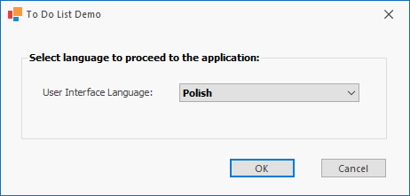</img>

3. The main screen of the application shows calendar view with lots of options to configure parameters of the view (current day, current workweek, current full week, current month etc.)

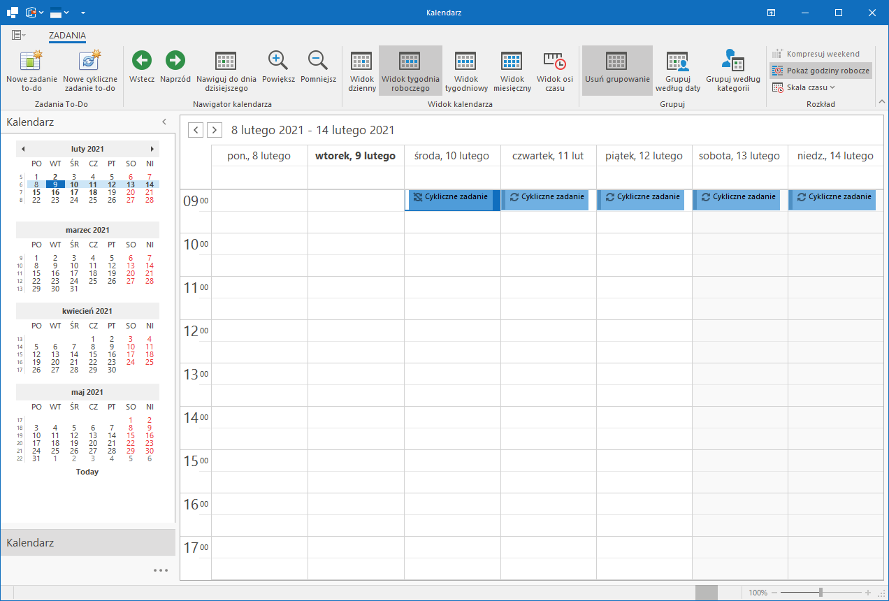</img>

4. Creating new to-do one-time tasks can be done by clicking "Nowe zadanie to-do" in the top left corner of the window and it opens a new form:

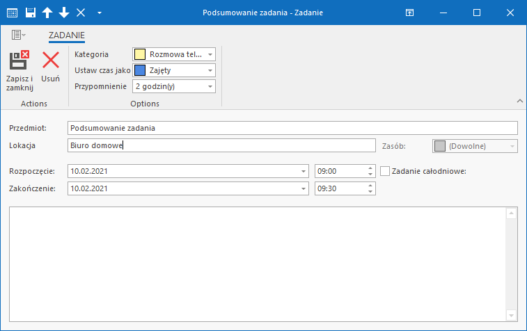</img>

5. Creating new cyclical tasks can be done by clicking "Nowe cykliczne zadanie to-do" in the top left corner of the window and it opens a similar task edit form like in case of one-time to-do tasks:

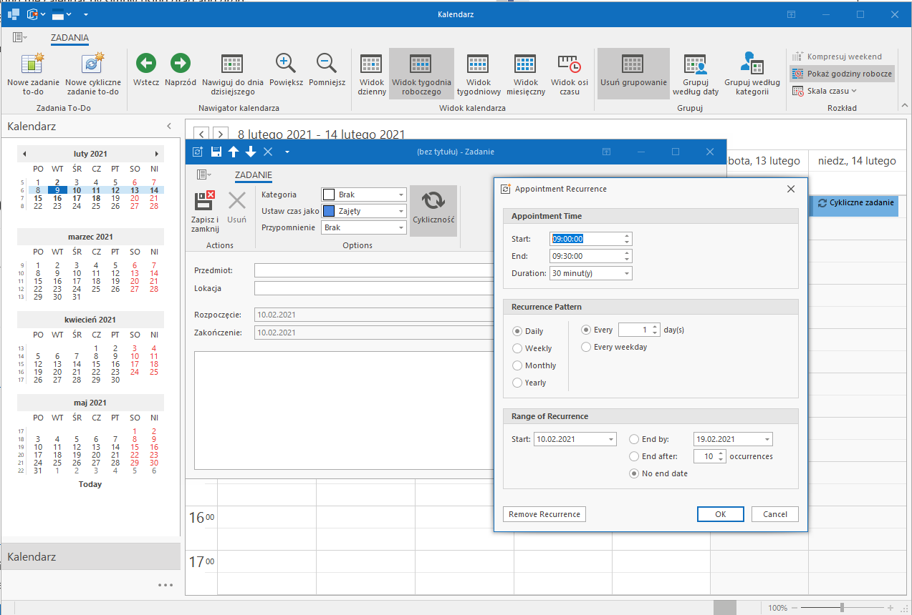</img>

. 

NOTE: in the current implementation the recurrence edit form has not been localized fully for the Polish language.

## Calendar View Options

1. Buttons "Wstecz" and "Naprzód" allow navigating the current calendar view a time period into the past or a time period into the future.

Current date:

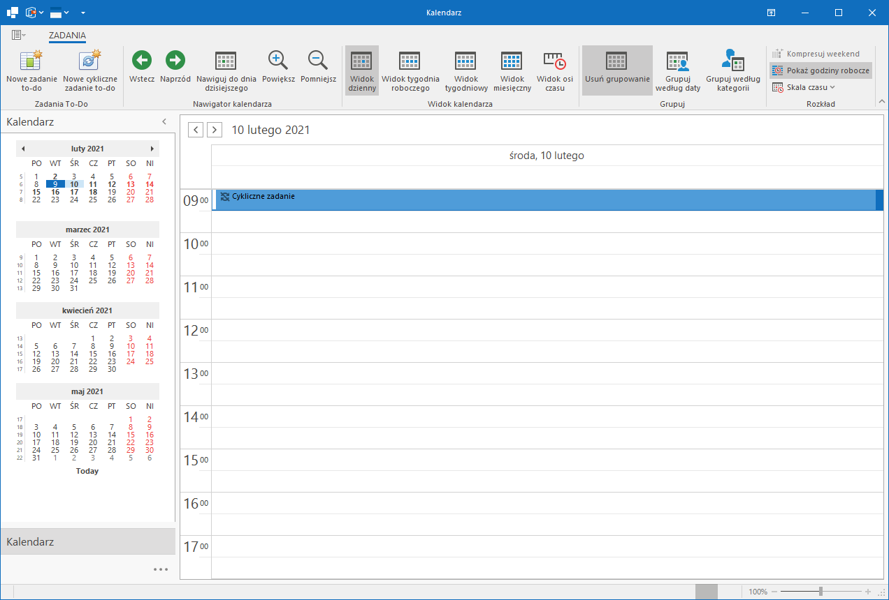</img>

After clicking "Wstecz" button:

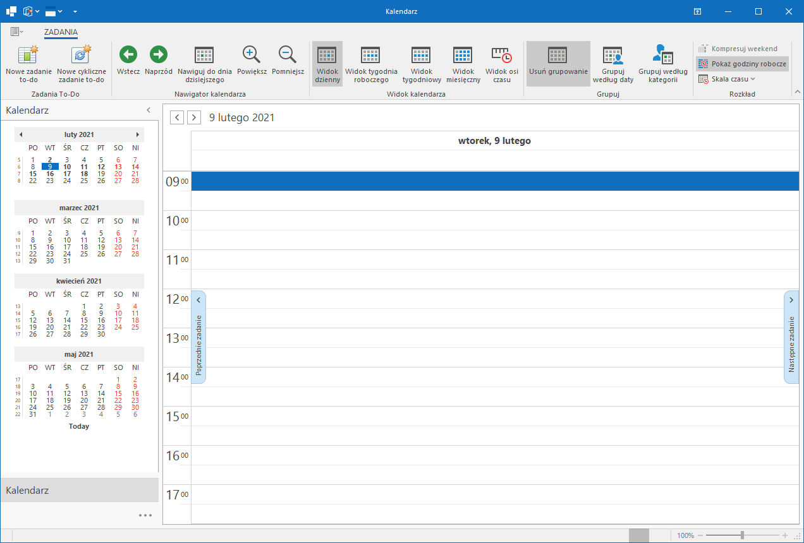</img>

After clicking "Naprzód" button:

</img>

2. Ribbon buttons from "Widok kalendarza" group allow for the following calendar display modes:
   1. "Widok dzienny" (Daily View) - shows daily view - presents a single day with hours.
   

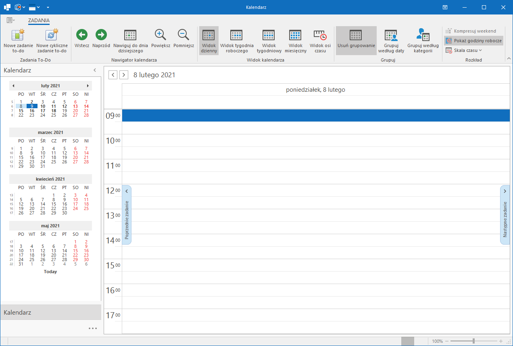</img>

   2. "Widok tygodnia roboczego" (Workweek View) - shows view of Monday to Friday (Saturday and Sunday are not included in this view)
      

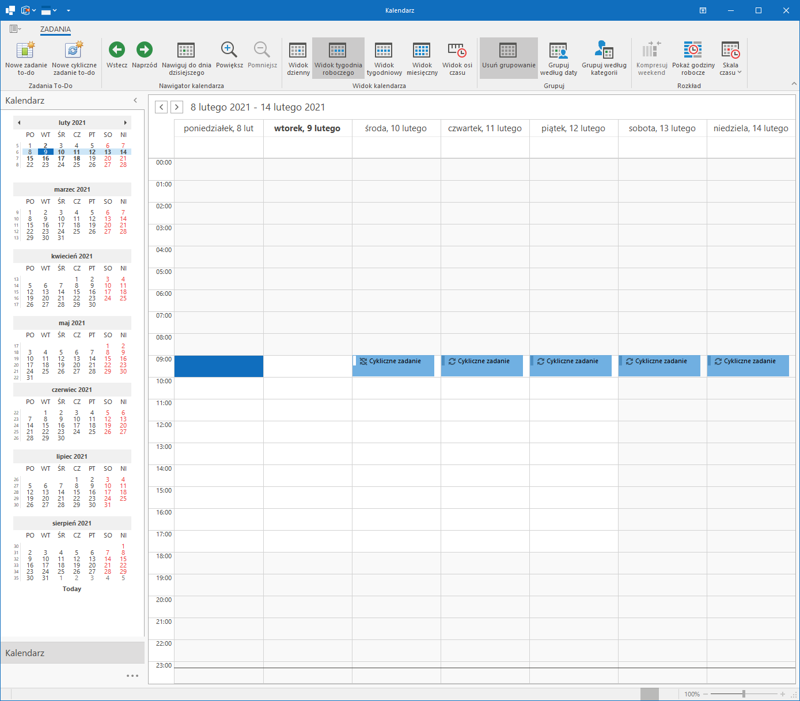</img>

	1. In this view and in Daily View there is an option ("Pokaż godziny robocze"), which changes in the calendar view the lower and upper hour range displayed. 
	Working hours typically start at 9:00 AM and end at 5:00 PM. If this option is not enabled, the calendar view shows hours 0:00 AM to 11:59 PM.

</img>

   3. "Widok tygodniowy" (Week View) - shows view of Monday to Sunday

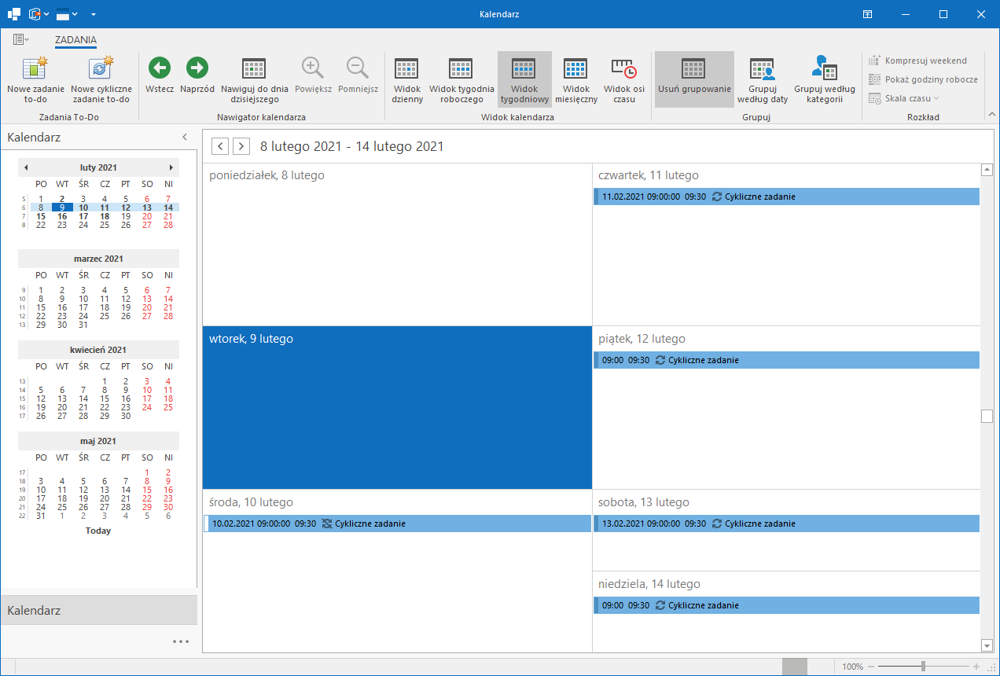</img>

  
   4. "Widok miesięczny" (Month View) - shows a summarized view of an entire current month

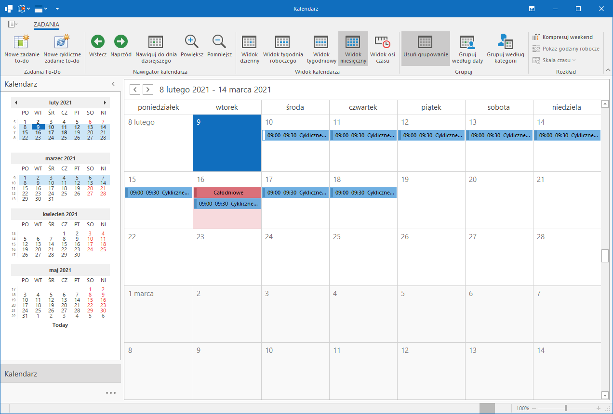</img>

		1. In this view there is an additional option ("Kompresuj Weekend"), which shows Saturday and consecutive Sunday as a single day, while displaying tasks potentially scheduled for those weekend days
Effect of this option is visible in the rightmost column in the Calendar View - Saturday and Sunday and mentioned as a single day (Sat/Sun).

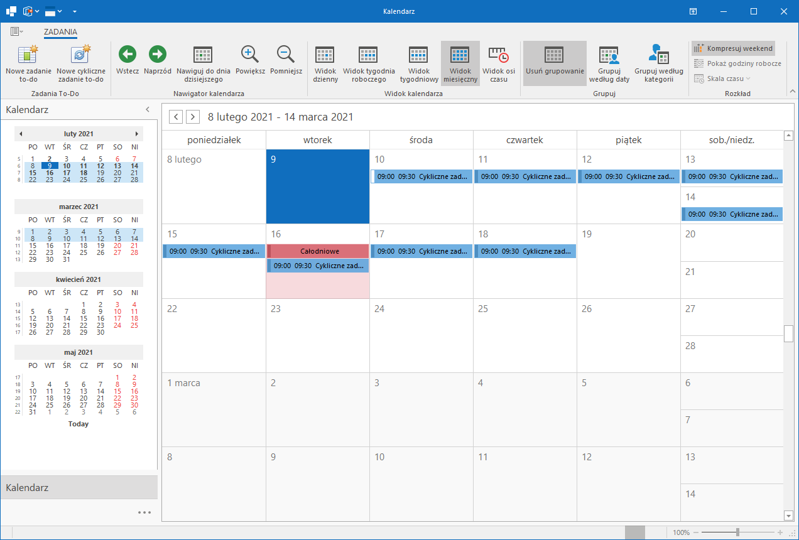</img>

   5. "Widok na osi czasu" (Timeline view) - tasks are displayed depending on date and time they are scheduled to start

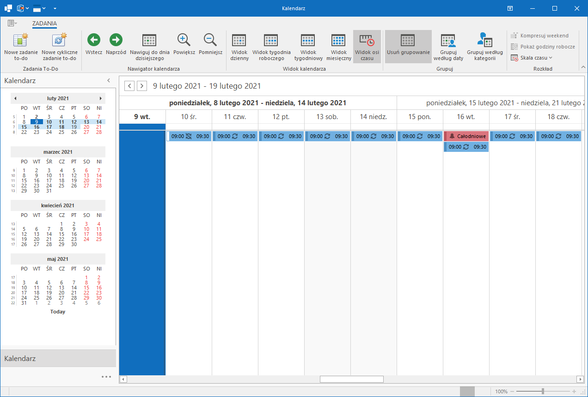</img>

    
		1. In this view there is an additional option ("Skala czasu"), which allows visually compressed view of scheduled tasks.

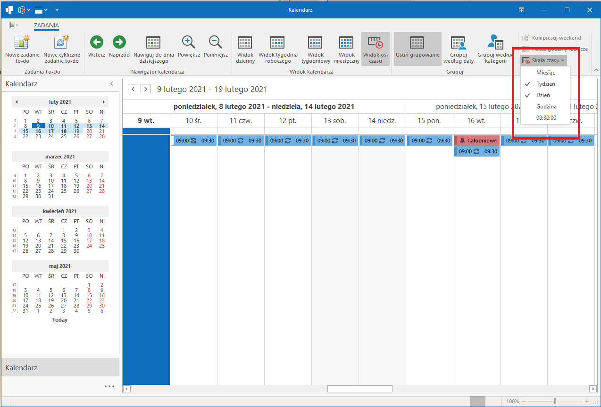</img>

   # Application options in Calendar mode
When clicked on the backstage view's icon (top left of the window, just below application window's title bar), the user can see additional options to export/import/print calendar and tasks.

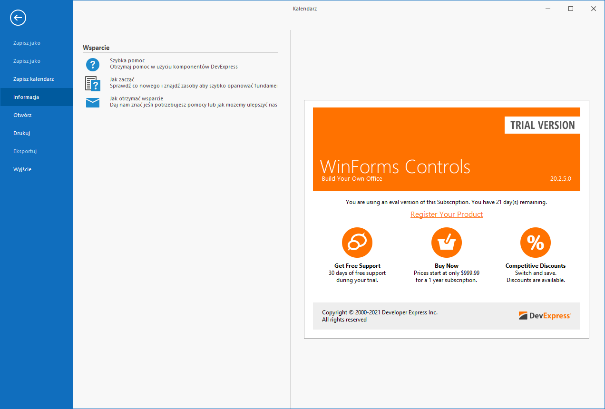</img>

